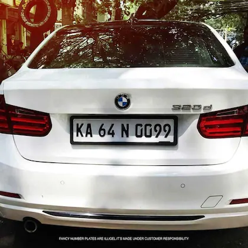

# 🚗 Vehicle License Plate Detector (ALPR)

An automated License Plate Recognition system built with **Python**, **YOLOv11**, and **EasyOCR**. This project localizes vehicle license plates in images and extracts the alphanumeric text into a structured format. Developed as part of my final year BCA portfolio at the **University of Mysore**.

## 🌟 Key Features
* **Object Detection:** Leverages YOLOv11 for high-precision vehicle and plate localization.
* **Optical Character Recognition (OCR):** Uses EasyOCR to transcribe plate text into digital strings.
* **Data Logging:** Automatically records detected plates and timestamps into a `plate_log.csv` file.
* **Mac Optimized:** Configured to handle SSL certificate requirements and MPS (Metal Performance Shaders) for MacBook Air.

## 🛠️ Technology Stack
* **Language:** Python 3.14
* **AI Frameworks:** Ultralytics (YOLOv8/v11), EasyOCR
* **Tools:** OpenCV, VS Code, Git

## 📂 Project Structure
* `main.py`: The core logic for detection and OCR.
* `test.jpg`: Sample image for testing the detection pipeline.
* `.gitignore`: Prevents heavy AI weights and environments from being uploaded.
* `requirements.txt`: List of Python dependencies.
* `plate_log.csv`: The generated database of detected vehicles.

## 📸 Sample Detection

*Detection and extraction of vehicle identification data.*

## 🚀 Getting Started
1. **Clone the repo:**
   ```bash
   git clone [https://github.com/rahitya0205/License-Plate-Detector.git](https://github.com/rahitya0205/License-Plate-Detector.git)
